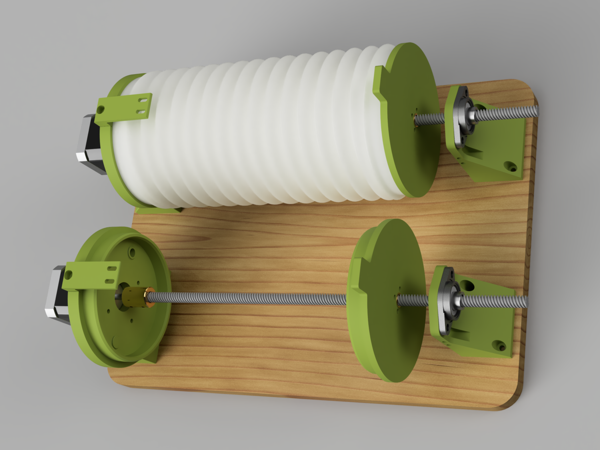
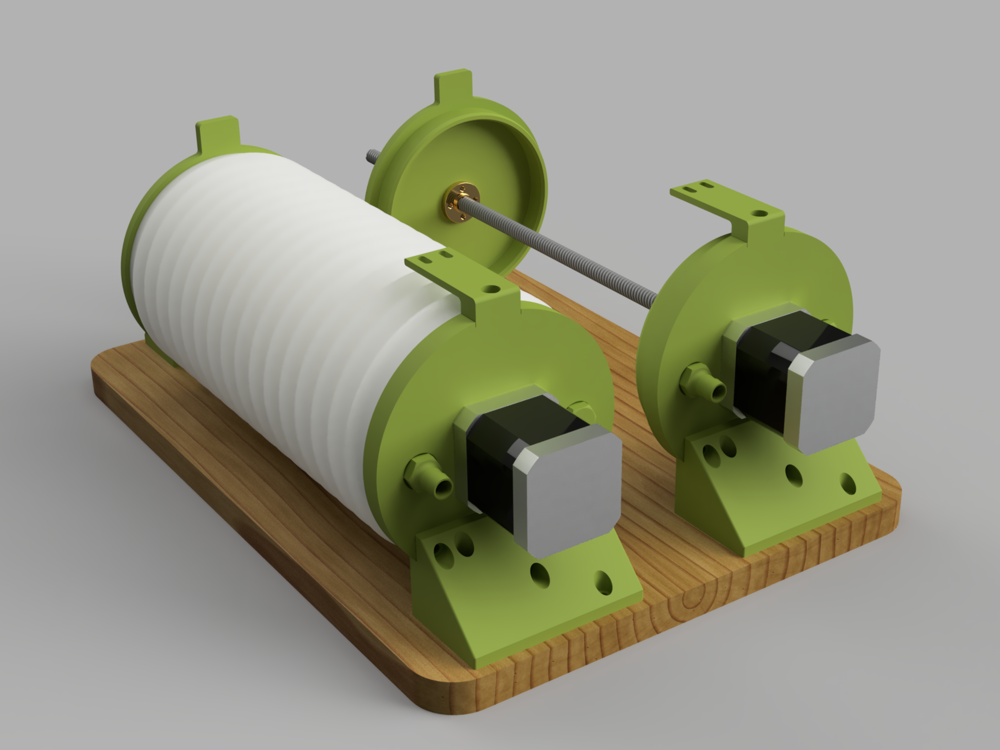
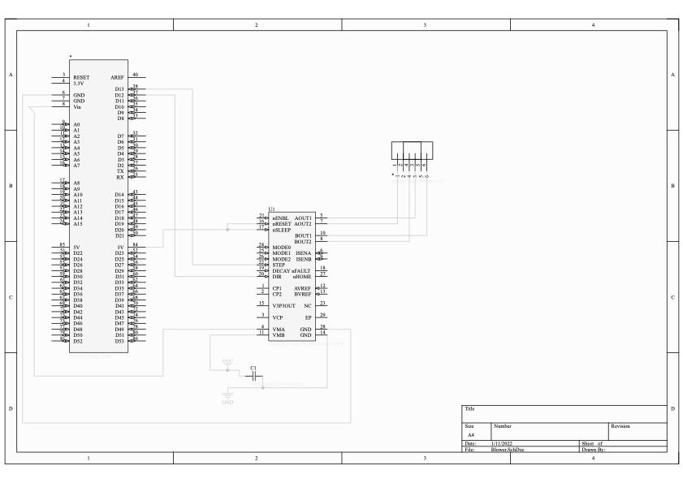

# Blowing Module

  

  

## Bill of Materials

### Purchase
| Item | Quantity | Details | Example Supplier |
| -------- | -------- | -------- | ------- |
| Board (plywood or breadboard) | 1 | 350 x 250 x 15 mm | |
| Stepper Motor | 2 | NEMA 17, 4 wire | [Ooznest](https://ooznest.co.uk/product/nema17-stepper-motors/?attribute_pa_model=1-8-1703hs168a-62oz-1-68a)|
| Lead screw | 2 | 8 mm lead, 290 mm | [Ooznest](https://ooznest.co.uk/product/acme-8mm-lead-screw/?attribute_pa_screw-length=290mm)|
| Lead screw nut | 2 | | [Ooznest](https://ooznest.co.uk/product/acme-nut/) |
| Lead screw to motor coupler | 2 | | [Ooznest](https://ooznest.co.uk/product/rigid-motor-shaft-coupler/?attribute_pa_size=5x8mm) |
| Bearing | 2 |  Flange[^bearing] bearing, 8 mm ID ||
| M3 x 20 mm bolt and nut | 8 | | [Kayfast](https://www.kayfast.co.uk/category/537/Metric-Socket-Cap-Screws) |
| M3 x 16 mm bolt | 8 | | [Kayfast](https://www.kayfast.co.uk/category/537/Metric-Socket-Cap-Screws) |
| M5 x 25 mm bolt and nut | 4 | | [Kayfast](https://www.kayfast.co.uk/category/537/Metric-Socket-Cap-Screws) |
| M3 x 8 mm bolt | 8 | | [Kayfast](https://www.kayfast.co.uk/category/537/Metric-Socket-Cap-Screws) |
| Pan head wood screw | 16 | 1/2" x no.6 (12 mm x 3.5 mm) | [Toolstation](https://www.toolstation.com/self-tapping-pan-head-pozi-screw/p74035) *or* [Kayfast](https://www.kayfast.co.uk/category/584/Pozi-Pan-Self-Tapping-Screws)|
| Limit switch | 4 |  | Ooznest |
| Arduino Uno | 1 | | |
| DRV8825 motor driver | 2 |  |
| 100 uF capacitor | 1 |  |
| 12V 2A power supply | 1 |  |
| Lung walls: flexible concertina material | 2 x 300 mm | e.g Ducting Hose | [Screwfix](https://www.screwfix.com/p/manrose-pvc-flexible-ducting-hose-white-1m-x-100mm/17297)|
| Cable ties | 4 | 450 mm long | |
| 8 mm tubing | 200 mm |  | |
| Stripboard, wires, connectors *OR* breadboard[^breadboard] and jumper wires |  |  |

[^breadboard]: Whilst a breadboard can be used, we recommend soldering to a stripboard for reliability.
[^bearing]: A pillowblock bearing could also be used if the bearing support was modified but we had flange bearings so used them.

### Make
| Item | Quantity | Method | Model |
| - | - | - | - |
| Bottom cap | 2 | 3D Print | [`bottom-cap.3mf`](bottom-cap.3mf) |
| Bottom cap support | 2 | 3D Print | [`bottom-cap-support.3mf`](bottom-cap-support.3mf) |
| Top cap | 2 | 3D Print | [`top-cap.3mf`](top-cap.3mf) |
| Limit switch mount | 2 | 3D Print | [`limit-switch-mount.3mf`](limit-switch-mount.3mf)
| Hose fitting | 2 | 3D Print | [`hose-fitting.3mf`](hose-fitting.3mf)
| Plug fitting | 2 | 3D Print | [`plug.3mf`](plug.3mf)|
| Mouthpiece connector | 1 | 3D Print | [`pipe-to-mouthpiece.3mf`](pipe-to-mouthpiece.3mf)|

All of our parts were printed in PLA. 0.4 mm nozzle, 0.2 mm layer height, 2 walls, 20% infill are adequate settings. Depending on our printer you may need support for the Lung Base.

### Combining air
A major limitation of the current implementation is no effective way to combine the air streams from the two lungs. We have experimented with off the shelf one way valves (passive solution) but they took too much pressure to overcome. We have also tried building a solenoid actuated diverter 4/2 valve (active solution) but was too leaky or took too much force to actuate. Experimentation is ongoing in the lung-hardware branch. A passive solution is preferred that is low cost and open source friendly.

## Assembly Instructions

<!-- 

  

 -->

1. Obtain and make all the parts listed above.
1. Attach the bottom cap to its support with pan head screws.
1. Secure the bottom cap and support to the board with pan head screws.
1. Attach the motor to the bottom cap using M3 x 16 mm screws.
1. Join the lead screw to the motor shaft with the coupler.
1. Slide the lung wall over the lead screw.
1. Insert the lead screw nut into the top cap and secure with M3 x 20 mm screws. Thread the assembly onto the lead screw.
1. Attach the bearing to the bearing support with M5 x 25 mm screws and slide over the lead screw.
1. Line up the bearing so it is inline with the shaft and lead screw, secure the bearing support to the board with pan head screws and tighten the bearing grub screws onto the lead screw.
1. Attach the lung walls to the top and bottom cap using cable ties.
1. Attach the limit switch mount to the bottom cap with a pan head screw.
1. Attach the limit switches to the mount and bearing support using the M3 x 8 mm screws.
1. Thread the hose fitting and plug fitting into the base
1. Push the 8 mm tubing onto the fitting and the mouthpiece connector onto the tubing.
1. Repeat steps 2 to 14 for the other lung.
1. On a using stripboard or a breadboard, connect each stepper motor to a motor driver, and the power supply and capacitor as detailed on the [DRV8825 page](https://www.pololu.com/product/2133).
1. Connect 5V, GND, STEP, DIR pins of the driver to the Arduino, noting the pin numbers.
1. Wire the limit switches in N.O. configuration with one lead to ground and the other to a pin on the Arduino, noting the pin number.
1. Prepare a cable to connect the GND, and I2C (SCL & SDA) lines of the Arduino to the Arduino of the Fingering Module.