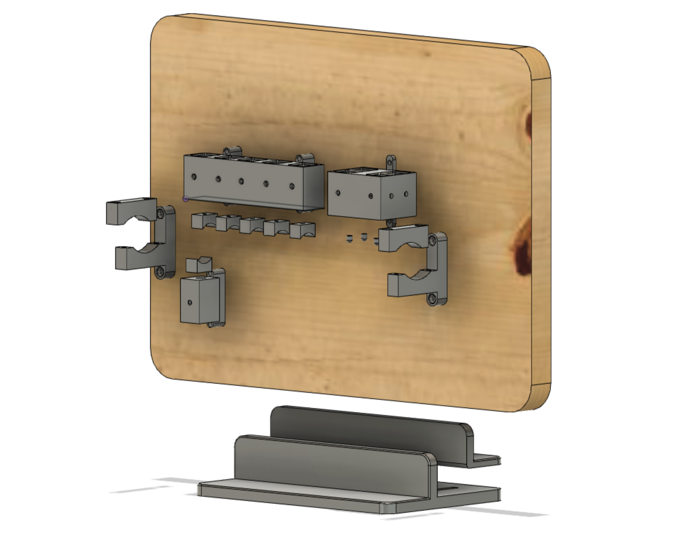
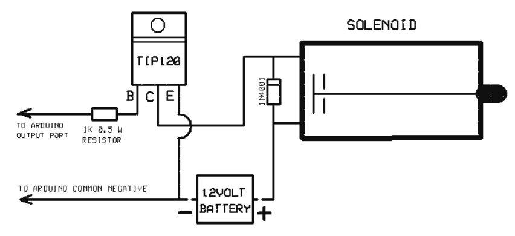

# Fingering Module

  

You will need the following prepared parts (some will require 3D printing) in order to build the Fingering module.

## 3D Printed Parts

1) 1 off 3D printed recorder base frame stand [bottom](recorder_base_frame_stand_bottom.stl). 

2) 1 off 3D printed recorder base frame stand [top](recorder_base_frame_stand_top.stl). This fits to the base frame bottom creating a clamp for the plywood mounting frame.

3) 2 off 3D printed recorder [clamps](recorder_clamp.stl) that will hold the recorder in position on the plywood mounting frame

4) 1 off 3D printed [five solenoid container body](five_seater_container_body.stl) (for finger tune hole solenoids)

5) 1 off 3D printed [single solenoid container body](one_seater_container_body.stl) (for thumb tune hole solenoid)

6) a) 1 off 3D printed [four solenoid container body](four_seater_container_body.stl) (for two double tone hole solenoids)

6) b) 1 off 3D printed [two solenoid container body](two_seater_container_body.stl) (for two double tone hole solenoids)
    -   To simplify the build, you can use this part instead of the four solenoid container body on the double tone holes. This means both double tone holes will get covered at the same time. Print off two extra square finger pads to use with this part.

7) 6 off 3D printed [square finger pads](square_finger_pad.stl) (one for each of the recorder middle joint five solenoids and one for the single thumb solenoid)

8) 2 off 3D printed [large fingerpads](double_hole_finger_pad_large.stl) (for larger hole in the double tone hole)

8) 2 off 3D printed [small fingerpads](double_hole_finger_pad_small.stl) (for smaller hole in the double tone hole)

9) 2 off 3D printed [extension arms](double_tone_hole_extension_arm.stl) (one for each of the double tune hole large fingerpads)

### Printing 

Most printers should be able to print the parts, with all parts being able to fit on a 150mmx140mm build plate.

On an Ultimaker 2+, we achieved good results with the following settings:

- layer height: 0.2mm
- wall thickness: 1.5mm
- infill density: 20%
- infill pattern: grid
- print speed 80 mm/s
- supports where required for the recorder base frame.

Parts have been printed using PLA and TPU (TPU for the fingerpads) all with good results. The print was not affected very much by the print settings. However, printing slower and with smaller layer height will improve the print quality. Tree supports where found to be easier to remove from prints in post processing although normal supports can be used instead. Both .stl and .obj files have been provided.

## Bill of Materials
The robot recorder player relies on readily available hobby electronics components in the spirit of the CERN-OHL-W. The components can be changed for other makes or types but changing the components will have an effect on how each module operates, for some types of woodwind instruments changes may be needed to allow the modules to operate as desired. Links have been provided for UK suppliers for the components used to create the module, these suppliers are not the only source of the components and they can be bought from other suppliers or locations. 

You will need the following components:

### General

- 1 off Arduino mega was used for this project although any Arduino can be used [UK](https://www.amazon.co.uk/ELEGOO-Controller-ATmega2560-ATMEGA16U2-Compatible/dp/B06XKMZ3T9/ref=sr_1_1_sspa?dchild=1&keywords=Arduino+mega&qid=1614255721&sr=8-1-spons&psc=1&spLa=ZW5jcnlwdGVkUXVhbGlmaWVyPUEzM1FEMENJVzdIVEk4JmVuY3J5cHRlZElkPUEwNTU1OTQ0MjQ4N0QxTTZZNFdDUCZlbmNyeXB0ZWRBZElkPUEwMzI4MTAzMTlYOUw0TUpKUThYMiZ3aWRnZXROYW1lPXNwX2F0ZiZhY3Rpb249Y2xpY2tSZWRpcmVjdCZkb05vdExvZ0NsaWNrPXRydWU=)

- 12V battery is needed to power the modules [UK](https://www.amazon.co.uk/SUNPADOW-Battery-Airplane-Quadcopter-Helicopter/dp/B08Q79M7QB/ref=sr_1_2?dchild=1&keywords=12V+LIPO&qid=1614255912&sr=8-2)

- 10 off JF-0530B solenoids [UK](https://www.amazon.co.uk/Rtengtunn-JF-0530B-Push-Pull-Gangbei-0530B-Electromagnet/dp/B08291L2XL/ref=sr_1_7?dchild=1&keywords=JF-0530B&qid=1614263171&sr=8-7)

- 10 off M3 nut and bolt, 1 for each solenoid to add tension and keep secured in position [UK](https://www.amazon.co.uk/Screw-Bolts-Stainless-Steel-340pcs/dp/B08RRW6B3H/ref=sr_1_12?dchild=1&keywords=M3+nut+and+bolt&qid=1614263398&sr=8-12)

The following are needed per-solenoids used:

- TIP120 Darlington Transistor [UK](https://www.amazon.co.uk/BOJACK-Epitaxial-Transistor-Darlington-Transistors/dp/B08D8SJPCG/ref=sr_1_4?dchild=1&keywords=TIP120+Darlington+Transistor&qid=1614263478&sr=8-4)

- 1K Ohm Resistor [UK](https://www.amazon.co.uk/sourcing-map-Metal-Resistors-Tolerances/dp/B07LGM23Y4/ref=sr_1_10?dchild=1&keywords=1K+Ohm+Resistor&qid=1614263525&sr=8-10)

- 1N4001 Diode [UK](https://www.amazon.co.uk/ExcLent-100Pcs-1N4001-50V-Diode/dp/B07J3ZT55G/ref=sr_1_8?dchild=1&keywords=1N4001+Diode&qid=1614263550&sr=8-8)

The following is needed on a per build basis:

- 1 off 350mm x 250mm x 20mm piece of wood (plywood is ideal) used to mount the fingering module components and act as a mounting frame for the recorder robot. This will be placed in the recorder base frame stand.

## Build Instructions

### Fingering Module

  

1. Print out the recorder base frame (1 off x 2 parts), five seater container body (1 x off), four seater container body (1 x off), a single seater container body (1 x off), large finger pad (2 x off), small finger pad (2 x off) and small finger pad extension arms (2 x off). Use the assembly drawing as an aid. Remove any other stray parts from the printing process
2. Insert a M3 nut into the internal side wall of the 3D-printed five solenoid container body, repeat this for each
location where a solenoid is required for tune hole fingering. 
3. Push the solenoid wires through the holes at the rear of the container body and insert a solenoid into each seating position (one for each tune hole across the recorder), making sure that the solenoid plunger can freely move up and down. 
4. Insert a M3 bolt through solenoid container and through the M3 nut to tighten the solenoids into position. Only a light finger tight is required. If the plunger does not move freely and gets stuck carefully un-tighten the bolt and move the solenoid until the plunger moves freely.
5. Repeat the above for each solenoid location in the five seater container body, the single container body and four seater container body
6. connected solenoid circuit following the wiring diagram 
    -   connect one solenoid contact to the common power rail.
    -   connect the other solenoid contacts to the middle pin (pin C) of the darlington transistor.
    -   connect the diode between the two solenoid contacts, make sure that the
white stripe on the diode is on the negative side of the connection. The
diode acts as a power snubber preventing power spikes from the solenoid
damaging the other electrical components.
    -   connect the resistor to pin B of the transistor then to one of the digital
ports of the arduino, the port depends on the tune hole the solenoid seals
down on, currently the thumb tune hole is to port 1 on the arduino.
    -   connect pin E of the transistor to the common ground rail.
7. Once the connections are made attach the finger pads to each of the the required solenoids. The square fingerpads with a concave seal should be used on the five seat container body solenoids. The small domed finger pads are intended for the two 3mm diameter holes in double tune holes. The large domed finger pads are intended for the 4mm diameter holes in the double tone holes. The extension arms can also be used for the larger 4mm diameter tone holes. 
8. Mark out on the plywood mounting frame the position of each tone hole and the top edge and bottom edge of the recorder. Aos mark out suitable locations for the solenoid cable holes to be drilled through the plywood mounting frame to connect later to the breadboard that will be placed at the back of the nmounting frame. When placing the solenoid container bodies into position onto the mounting frame, it is important to not mount them further than 10mm from the top and bottom edges of the recorder otherwise the solenoids will not seal against the holes when actuated. 
8. To attach the five solenoid container body to the recorder base frame insert a M3 nut in to the slot on the top and bottom of the container body, then align the container bodies as required to cover the holes and previously marked out. This may require some further measurements and tweaking on the plywood mounting frame.  
9. Mark out and attach the two recorder clamps as to ensure that the middle joint holes are directly under the five seater container body and that the single seater container body is located directly under the recorder thumb hole. Feel free to use a small piece of rubber to add grip to the recorder when in the clamp.
10. Secure all the components using 3mm nuts and bolts. 
11. Once completed seat your new recorder mounting frame with the new components added into the recorder base stand. It should now being standing vertically, making it easy for you to see the fingering actuation during play.
12. Test the placement of the components and adjust where required. To finish, thread the solenoid cables to the rear of the plywood moutning frame where they can then be connected onto the breadboard. 

### Acknowledgements
The page has been 'forked' from Andrew Henry's, <a href="https://gitlab.com/Andrew_Henry/automated-guitar">automated guitar player</a>

